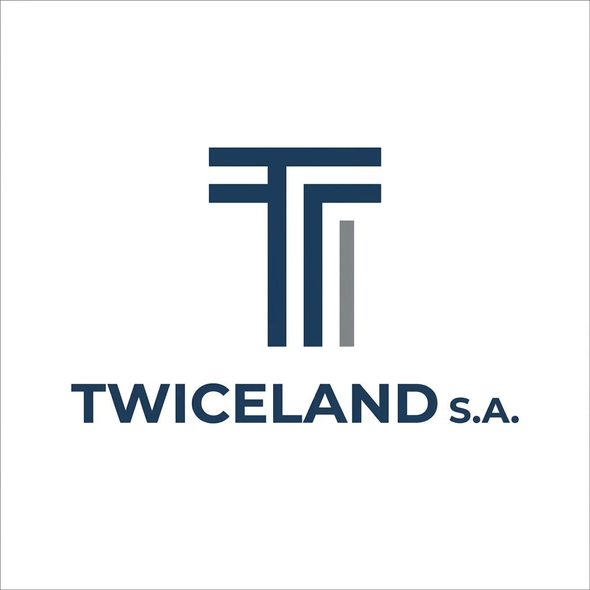
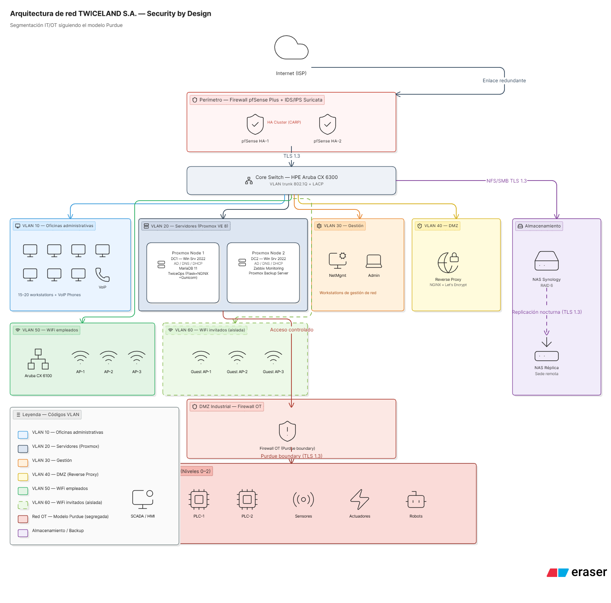
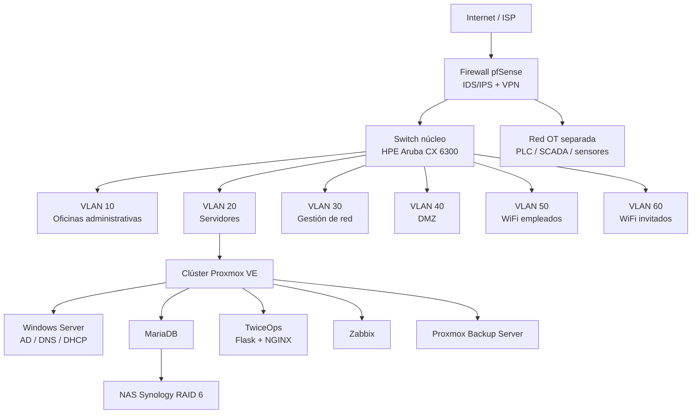
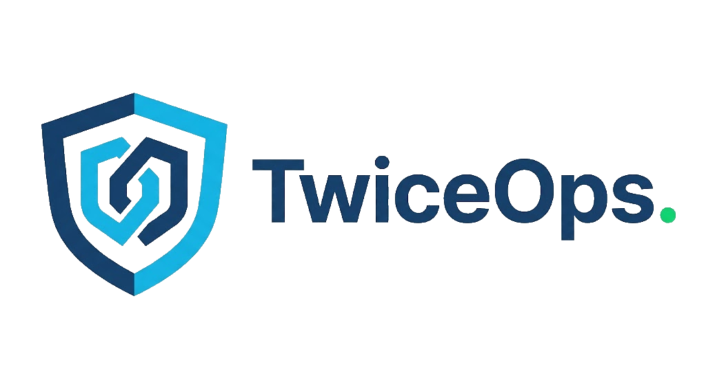
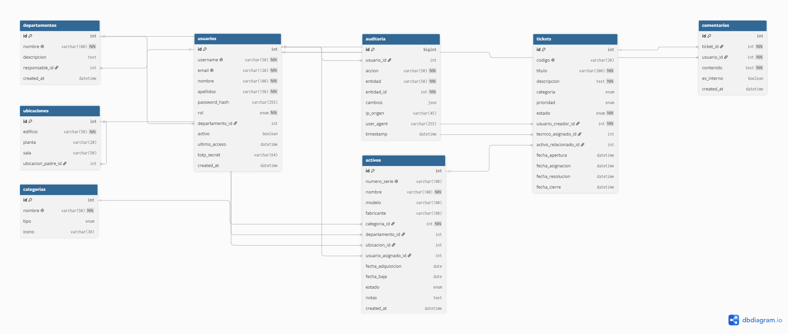

<div align="center">



# Proyecto Intermodular · TWICELAND S.A.

### Diseño de Infraestructura IT con Enfoque Security by Design

Arquitectura de red, sistemas y seguridad, y diseño de la plataforma interna **TwiceOps**.

<br />

**Alumno:** Levi Herrera Apaza  
**Ciclo formativo:** Administración de Sistemas Informáticos en Red (ASIR)  
**Curso académico:** 2025 - 2026  
**Repositorio:** [BluX-Myoui/twiceland-it](https://github.com/BluX-Myoui/twiceland-it)  
**Prototipo TwiceOps:** [v0-twiceops-ui-design.vercel.app](https://v0-twiceops-ui-design.vercel.app/)

</div>

---

## Resumen

Este repositorio acompaña el Proyecto Intermodular de primer curso de ASIR. El trabajo plantea el diseño de la infraestructura tecnológica de **TWICELAND S.A.**, una empresa ficticia del sector industrial que sirve como caso de estudio para aplicar conceptos de redes, sistemas, seguridad y gestión IT.

El objetivo principal es definir una infraestructura completa desde una perspectiva **Security by Design**, es decir, pensando la seguridad desde el inicio del diseño y no como una capa añadida al final. Por este motivo, el proyecto no se limita a elegir servidores o switches, sino que organiza la red, los servicios, los permisos, la auditoría y la continuidad del negocio de forma coherente.

El PDF original del trabajo no se publica en este repositorio. Aquí se recoge una presentación resumida y ordenada del proyecto para su consulta en GitHub.

---

## Objetivo Del Proyecto

El proyecto cubre cuatro capas principales de la infraestructura:

- **Capa física:** rack, cableado estructurado, switches, firewall, servidores, NAS, UPS y condiciones básicas del CPD.
- **Capa lógica:** topología de red, direccionamiento IP, VLAN, separación IT/OT y control del tráfico entre zonas.
- **Capa de sistemas:** virtualización con Proxmox VE, Active Directory, DNS, DHCP, MariaDB, NGINX, Zabbix y copias de seguridad.
- **Capa de seguridad:** firewall perimetral, IDS/IPS, VPN, políticas de acceso, monitorización, auditoría y plan de continuidad.

Como parte diferencial se propone **TwiceOps**, una plataforma web interna para gestionar activos tecnológicos, incidencias de soporte y registros de auditoría.

---

## Arquitectura General

La arquitectura propuesta separa la red corporativa en VLAN, mantiene la red OT aislada y centraliza los servicios principales sobre un clúster de virtualización.





---

## TwiceOps

<p align="center">
  
</p>

TwiceOps es la herramienta interna propuesta para que TWICELAND pueda mantener el control de su infraestructura. No sustituye al diseño de red y sistemas, sino que lo complementa permitiendo registrar activos, gestionar incidencias y conservar trazabilidad sobre los cambios.

El prototipo navegable de la interfaz está disponible en Vercel: [https://v0-twiceops-ui-design.vercel.app/](https://v0-twiceops-ui-design.vercel.app/).

| Módulo | Función |
|--------|---------|
| Inventario | Registro de equipos, ubicaciones, departamentos y responsables |
| Helpdesk | Gestión de incidencias, prioridades, estados y técnicos asignados |
| Usuarios | Roles de administrador, técnico y usuario final |
| Auditoría | Registro de acciones relevantes y cambios sobre la infraestructura |
| Soporte inteligente | Sugerencias y detección de patrones en tickets |

Tecnologías previstas para la plataforma:

| Capa | Tecnología |
|------|------------|
| Servidor | Python 3.11, Flask, SQLAlchemy y Gunicorn |
| Cliente | HTML5, CSS3, JavaScript ES6 y Bootstrap 5 |
| Base de datos | MariaDB 11 |
| Identidad | Integración con Active Directory mediante LDAP |
| Despliegue | Ubuntu Server, NGINX, TLS y Proxmox VE |

### Modelo De Datos

El modelo de datos de TwiceOps se organiza alrededor de usuarios, departamentos, ubicaciones, activos, tickets, comentarios y auditoría. De esta forma, la plataforma puede relacionar cada incidencia con los equipos afectados y conservar un histórico de cambios.



---

## Seguridad By Design

El principio de **Security by Design** se aplica a todas las decisiones del proyecto. La red se segmenta por VLAN, la parte OT queda separada de la red IT siguiendo el modelo Purdue, el acceso remoto se realiza mediante VPN y los servicios críticos se protegen con políticas de mínimo privilegio.

En TwiceOps, este enfoque se refleja en el control de acceso por roles, el almacenamiento seguro de credenciales, las sesiones protegidas, la validación de entradas, el cifrado en tránsito y los logs de auditoría inmutables.

---

## Viabilidad Económica

La propuesta busca un equilibrio entre coste, calidad técnica y autonomía. Por eso combina soluciones open source maduras, como Proxmox VE, pfSense, MariaDB y Zabbix, con tecnologías comerciales cuando tienen sentido dentro de una empresa mediana, como Windows Server y Active Directory.

La inversión inicial estimada se sitúa en torno a **34.500 - 49.500 EUR**, con un coste anual aproximado de **4.800 - 7.100 EUR**. El proyecto justifica esta inversión por la reducción de riesgos, la mejora de la continuidad del negocio y el control directo de los datos.

---

## Recursos Visuales

La carpeta [`assets`](assets/) queda reservada para incluir los recursos visuales finales del proyecto:

- Diagrama general de arquitectura.
- Modelo entidad-relación de TwiceOps.
- Mockups principales de la interfaz.
- Capturas o imágenes de apoyo para la presentación.

---

## Estructura Del Repositorio

```text
twiceland-it/
├── assets/      # Recursos visuales finales del proyecto
├── .gitignore   # Archivos que no deben subirse a GitHub
└── README.md    # Presentación resumida del proyecto
```

---

## Autor

Proyecto académico realizado por **Levi Herrera Apaza** para el ciclo de **Administración de Sistemas Informáticos en Red (ASIR)**.
